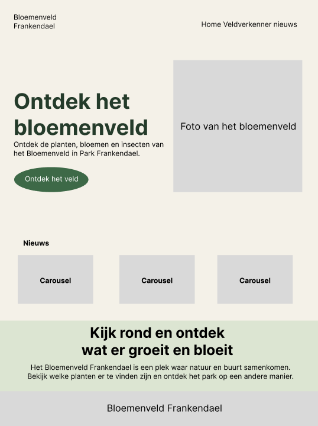
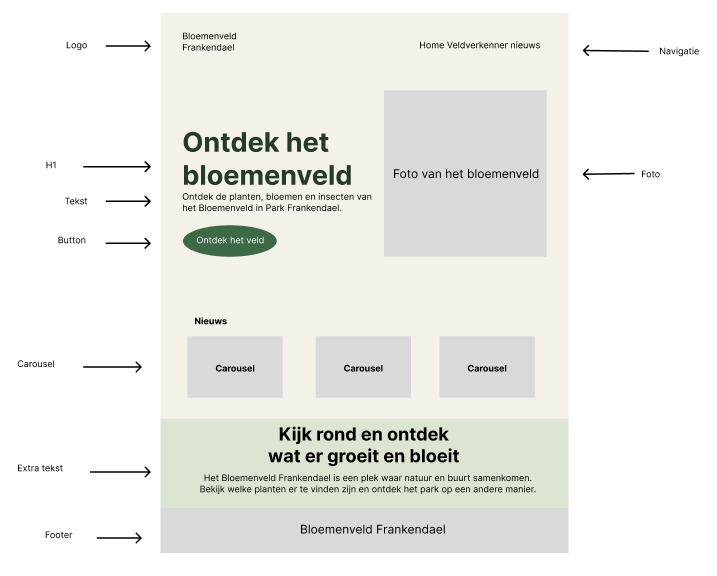

# Bloemenveld Frankendael - Webapp
Het Bloemenveld in Park Frankendael is een bijzondere plek in het park, waar veel groeit en leeft. Toch blijft de waarde van het veld voor veel voorbijgangers verborgen. Wat er groeit, bloeit en leeft, is niet altijd zichtbaar of makkelijk te begrijpen. Terwijl juist dit soort plekken een grote rol spelen in het versterken van stedelijke natuur en het vergroten van het bewustzijn rondom een duurzame leefomgeving. Daarom is er een duidelijke behoefte aan manieren om bewoners van Amsterdam Oost (Watergraafsmeer) op een laagdrempelige manier kennis te laten maken met de natuur dichtbij huis. Een ervaring die verder gaat dan alleen kijken en waarin bezoekers actief kunnen ontdekken, beleven en leren wat er in hun omgeving leeft.

#### Vraag van de opdrachtgever
Ontwerp en ontwikkel een webapp met een interactieve veldverkenner waarbij bezoekers in verschillende zones van de Bloementuin aan de hand van opdrachten planten en bloemen kunnen ontdekken. Bij het goed maken van de opdrachten kunnen badges worden verdiend

**Repository**

- [Kevin](https://github.com/KevinZ2004/Bloemenveld-Frankendael)

## Inhoudsopgave

  * [Beschrijving](https://github.com/KevinZ2004/Bloemenveld-Frankendael/README.md#beschrijving)
  * [Huisstijl]()
  * [Veldverkennner]()

## Beschrijving
<!-- Bij Beschrijving staat kort beschreven wat voor project het is en wat ik heb gemaakt -->
<!-- Voeg een link toe naar Github Page -->
Voor de opdrachtgever maken wij een website wat eigenlijk een webapp is. Het is de bedoeling dat de bezoeker een QR code kan scannen en dan vervolgens op de webapp komt. Er is dan een veldverkenner die je laat zien waar je op dat moment bevindt in het bloemenveld en dan kan je zelf op verschillende zones drukken in de app. Vervolgens krijg je een opdracht en informatie over de de debetreffende plant.

## Huisstijl

### Pagina's

* [Home](#homepage)
* [Veldverkenner]()
* [Nieuws]()

## Homepage

Op de homepagina heb je een overzicht van alle pagina's die te vinden zijn op de webapp. Daarna heb je een knop die linkt naar de interactieve veldverkenner en je krijgt de laatste 3 nieuwsberichten te zien in een carousel.

Hifi schets

Breakdown schets

## Veldverkenner

Op de veldbheer pagina zie je welke activiteiten er te doen zijn op het bloemenveld. Daarnaast kan je ook bij elk voedseleiland zien welke bloemen er zijn en wat je ermee kan doen.

